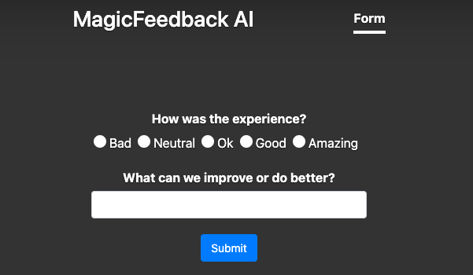

# MagicFeedbackAI SDK

This JavaScript library empowers you to effortlessly integrate the power
of [MagicFeedback.io](https://magicfeedback.io/) into your web applications. With minimal code, you can capture valuable
user feedback and insights, driving continuous improvement and enhancing user experience.

## Table of Contents

* [Install](#install)
* [Init](#init)
* [How to use](#how-to-use)
* [Style](#style)

## Install

This library is available as a [package on NPM](https://www.npmjs.com/package/@magicfeedback/native). To install into a
project using NPM with a front-end packager such as [Browserify](http://browserify.org/)
or [Webpack](https://webpack.github.io/):

```sh
npm i @magicfeedback/native
```

You can then require the lib like a standard Node.js module:

```js
var magicfeedback = require("@magicfeedback/native");

// or

import magicfeedback from "@magicfeedback/native";

```

## Init

This method is optional. You can start actived the debug mode to see on console the messages

```js
magicfeedback.init({
    debug: true | false, // Default false
    env: "prod" // Default 
})

```

## How to use

This guide provides instructions for utilizing various features and functionalities of the application. Each section
below highlights a specific use case and provides a code snippet to demonstrate its implementation.

### A. Generate feedback forms

The feedback form generation functionality allows you to easily create and display feedback forms on your website. This
section provides an overview of how to use this feature and the necessary code snippets.

To generate a feedback form, you need to include the following HTML code snippet in your web page:

```html

<div id="demo_form_div"></div>
```

This code snippet creates a placeholder element with the ID "demo_form_div" where the feedback form will be inserted.

Next, you need to include the following JavaScript code snippet in your application:

```js
let form = window.magicfeedback.form(
    "$_APP_ID",
    "$_PUBLIC_KEY"
);

form.generate(
    "demo_form_div",
    {
        addButton: true | false, // Default false, option to add a button to send the form
        sendButtonText: string, // Default "Send", option to change the text of the send button
        backButtonText: string, // Default "Back", option to change the text of the back button
        nextButtonText: string, // Default "Next", option to change the text of the next button
        addSuccessScreen: boolean, // Default flase, option to add a success screen after send the form
        successMessage: string, // Default "Thank you for your feedback!", option to change the success message
        questionFormat: "standard" | "slim", // Default "standard", option to change the format of the questions.
        getMetaData: boolean, // Default true, option to get the metadata of the form  
        beforeSubmitEvent: ({
                                loading: boolean,
                                progress: number,
                                total: number
                            }) => {
        }, //Function to execute before send the form
        afterSubmitEvent: ({
                               loading: boolean,
                               progress: number,
                               total: number,
                               response: string, // Response of the server if everything is ok
                               error: string, // Error of the server if something is wrong
                           }) => {
        }, //Function to execute after send the form with the response
        onLoadedEvent: ({
                            loading: boolean,
                            progress: number,
                            total: number,
                            formData: FormData
                        }) => {
        } //Function to execute after load the form

        /*
        class FormData {
            id: string;
            name: string;        
            description: string;        
            type: string;       
            identity: string;        
            status: string;       
            createdAt: Date;        
            updatedAt: Date;        
            externalId?: string | null;       
            companyId: string;        
            productId: string;       
            userId: string;        
            setting: Record<string, any>;        
            conf: Record<string, any>; 
      */
    }
)
```

In this code snippet, you need to replace $_APP_ID with the actual ID of your feedback application. This ID is provided
by the magicfeedback service.

The **form.generate()** function generates the feedback form inside the specified container element ("demo_form_div" in
this example). You can customize the form generation by including the optional parameters:

* **addButton**: This setting determines whether to include a "Submit" button that enables users to submit the form
  themselves. By default, this value is set to false, indicating that the button will not be displayed.
* **beforeSubmitEvent**: An optional function that you can define to execute some actions or validations before the form
  is submitted.
* **afterSubmitEvent**: An optional function that you can define to execute actions after the form is submitted. This
  function receives the server response as a parameter.
* **onLoadedEvent**: An optional function that you can define to execute actions after the form is loaded.

In teh case that you don't want to use the buttons of the sdk to manage the send and back actions, you can use the
following functions to manage the form.

```js 
form.send() // Get the answers in the form to send and go to the next question or finish.

form.back() // Go to the previous question.
```

If you would like to include additional information with your feedback, you can do so by adding it to the `metadata`
, `metrics` o `profile` variables. These variables are optional and should be formatted as follows:

```js
[
  {
    "key": "key_1",
    "value": "value_1"
  },
  {
    "key": "key_2",
    "value": "value_2"
  },
  /* ... */
]
```

Here is an example of how to submit feedback with additional information:

```js
form.send(
    metadata, //{key:string, value:string[]}[] OPTIONAL
    metrics, //{key:string, value:string[]}[] OPTIONAL
    profile, //{key:string, value:string[]}[] OPTIONAL
)
```

This function triggers the submission of the generated feedback form.



By following these steps and including the appropriate HTML and JavaScript code snippets, you can easily generate and
display feedback forms on your website using the magicfeedback service.

### B. Send feedback directly

With this option you can send feedback directly without generate a form. This section provides an overview of how to use
this feature and the necessary code snippets.

To send feedback directly, you need to include the following JavaScript code snippet in your application:

```js 
window.magicfeedback.send(
    "$_APP_ID",
    "$_PUBLIC_KEY",
    feedbackData,
    completed, // Default true
    "$_ID", // Optional
    "$_PRIVATE_KEY", // Optional
)
```

In this code snippet, you need to replace $_APP_ID with the actual ID of your feedback application and the $_PUBLIC_KEY
with the public key of your feedback application. This ID and key is provided by the magicfeedback service.

###### FeedbackData

Then, you can include the feedback data in an object with the following structure:

```js
    {
    text: "string", /* Optional */
    answers: [
      {
          key: 'string',
          value: ["string"]
      },
    ],
    metadata: [
      {
          key: 'string',
          value: "string"
      },
    ],
    metrics: [
      {
          key: 'string',
          value: "string"
      },
    ],
    profile: [
      {
          key: 'string',
          value: "string"
      },
    ]
}
```

* **key**: This setting determines the key of the feedback data.
* **value**: This setting determines the value of the feedback data.

Not all the fields are required. You can send only the fields that you need. But you need to send one of that minimal.

Finally, to send the feedback, you can use the magicfeedback.send() function.

## Style

This section provides the CSS code you can use to customize the appearance of your Magicfeedback form. By applying these
styles to the corresponding classes in your HTML, you can control the layout, colors, fonts, and other visual aspects of
your feedback form.

Feel free to adapt and expand upon the provided styles to match your desired design and branding.

```css
/* Overall container for the feedback form */
.magicfeedback-container {
    /* ... add your container styles here ... */
}

/* Main form element */
.magicfeedback-form {
    /* ... add your form styles here ... */
}

/* Section for questions */
.magicfeedback-questions {
    /* ... add your questions section styles here ... */
}

/* Section for div */
.magicfeedback-div {
    /* ... add your generic div styles here ... */
}

/* Generic styles for various input elements */
.magicfeedback-label,
.magicfeedback-input,
.magicfeedback-contact,
.magicfeedback-password,
.magicfeedback-email,
.magicfeedback-boolean,
.magicfeedback-date,
.magicfeedback-select,
.magicfeedback-radio,
.magicfeedback-checkbox,
.magicfeedback-rating,
.magicfeedback-rating-container,
.magicfeedback-rating-option,
.magicfeedback-rating-option-label-container,
.magicfeedback-number,
.magicfeedback-longtext,
.magicfeedback-text {
    /* ... add your generic input styles here ... */
}

/* Specific styles for individual input types */
.magicfeedback-radio-container,
.magicfeedback-boolean-container,
.magicfeedback-checkbox-container {
    /* ... add styles for radio/checkbox containers ... */
}

.magicfeedback-rating-image1,
.magicfeedback-rating-image2,
.magicfeedback-rating-image3,
.magicfeedback-rating-image4,
.magicfeedback-rating-image5,
.magicfeedback-rating-image6,
.magicfeedback-rating-image7,
.magicfeedback-rating-image8,
.magicfeedback-rating-image9,
.magicfeedback-rating-image10 {
    /* ... add styles for rating images ... */
}

/* Section for number rating */
.magicfeedback-rating-number-container {
    /* ... add your number rating container styles here ... */
}

.magicfeedback-rating-number-option {
    /* ... add your number rating option styles here ... */
}

.magicfeedback-rating-number-option-label-container {
    /* ... add your number rating option label container styles here ... */
}


/* Section for star rating */
.magicfeedback-rating-star {
    /* ... add your star rating container styles here ... */
}

.magicfeedback-rating-star-container {
    /* ... add your star rating styles here ... */
}

.magicfeedback-rating-star-option {
    /* ... add your star rating option styles here ... */
}

.magicfeedback-rating-star-selected {
    /* ... add your star rating selected styles here ... */
}

/* Action buttons container */
.magicfeedback-action-container {
    /* ... add your action button container styles here ... */
}

/* Submit button */
.magicfeedback-submit {
    /* ... add your submit button styles here ... */
}

/* Back button */
.magicfeedback-back {
    /* ... add your back button styles here ... */
}

/* Success message (if applicable) */
.magicfeedback-success {
    /* ... add your success message styles here ... */
}
```

## Collected Metadata

### Browser Metadata (navigator object):

* **navigator-url (Browser URL)**: This captures the full URL, including any query parameters, using window.location.href.
* **navigator-origin (Browser Origin)**: This retrieves the origin portion of the URL (protocol, host, and port) using
window.location.origin.
* **navigator-pathname (Browser Pathname)**: This extracts the path component of the URL using window.location.pathname.
* **navigator-search (Browser Search Parameters): This captures the query string (search parameters) from the URL using
window.location.search.
* **navigator-user (User Agent)**: This retrieves a string identifying the browser and its version using navigator.userAgent.

* **navigator-language (Browser Language)**: This captures the user's preferred language setting from the browser using
navigator.language.
* **navigator-platform (Browser Platform)**: This retrieves the operating system platform the browser is running on using
navigator.platform.
* **navigator-appVersion (Browser Application Version)**: This captures the browser application version using
navigator.appVersion. 
* **navigator-appName (Browser Application Name)**: This retrieves the name of the browser application using
navigator.appName. 
* **navigator-product (Browser Product)**: This captures the name of the browser's rendering engine using navigator.product.


### Screen Metadata (screen object):

* **screen-width (Screen Width)**: This retrieves the width of the user's screen in pixels using window.screen.width.
* **screen-height (Screen Height)**: This captures the height of the user's screen in pixels using window.screen.height.
